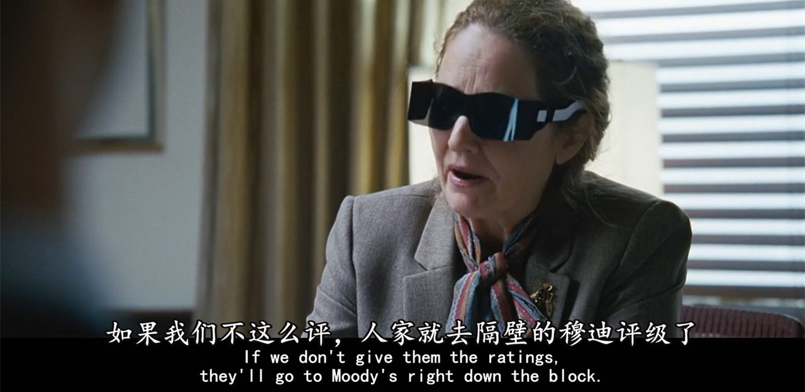
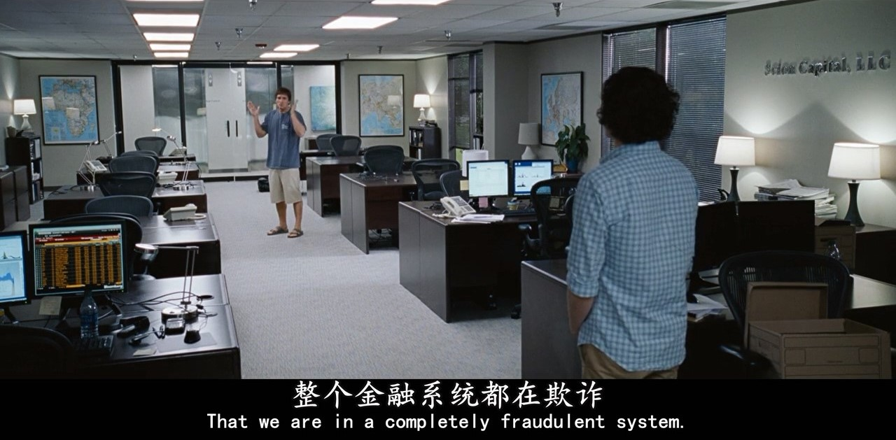
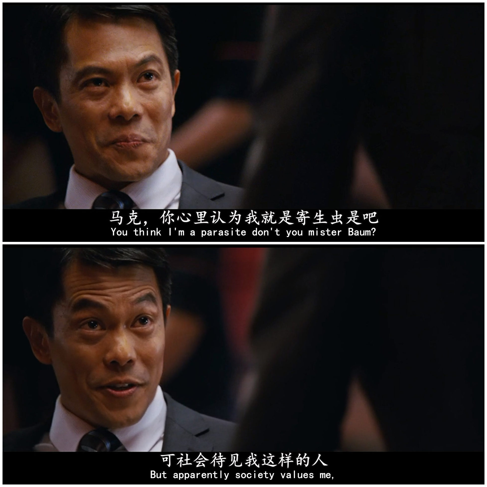
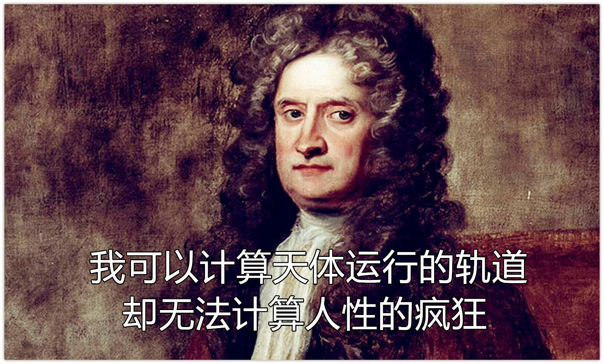
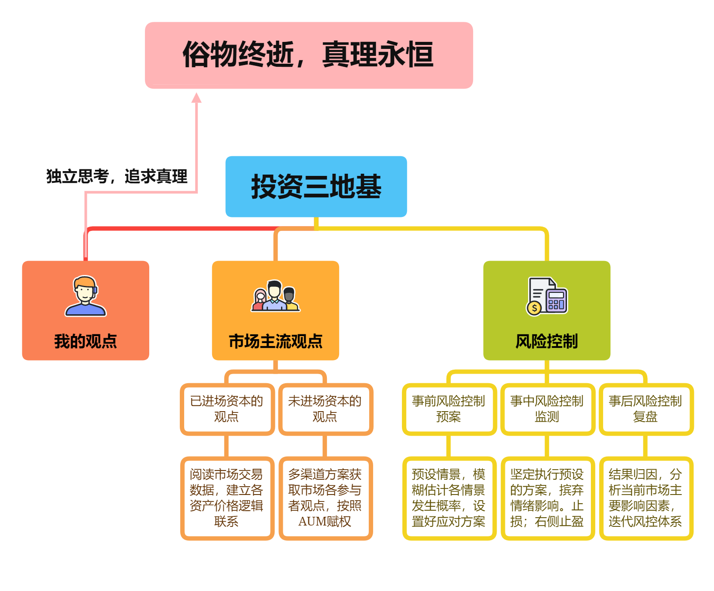

金融学本质上是一个人造学科，由人创造，被人影响。以物理思维来看待金融市场的运行原理，任何资产的价格本质上都是由所有市场参与者共同决定的，这是价格形成的最直接原因。当然，每个参与者的观点权重和自身的AUM（资产管理规模）正相关。

<!--more-->

金融由于其人造学科的本质，是没法精确预计的（详见[《金融不精确》](https://venus.caelumfamily.com/post/financeunprecise/)）。在金融中追求精确性，犹如在绝对真空环境中寻求空气一样荒谬。金融投资的过程，就是处理各种不确定性的过程。

我的投资框架包含三个地基性质的概念：**我的观点，市场主流观点，风险控制**。对一切资产的分析、投资都是从这三个地基出发。这是我的一切投资框架的通用性，根本性原理。

### 一. 我的观点

任何人都会有自己的观点，但观点的追求目标是什么，这涉及到个人价值观。物理学人的价值观很清晰明了——追求真理。对任何事都是如此，包括金融投资。

真理是什么？真理是客观事物及其规律的正确反映。金融学也是一门学科（虽然是人造学科），有其内在逻辑和规律，所以并非完全的瞎猜乱蒙，这门学科也存在真理，只是不精确、不稳定、不优雅。但我们依然要以追求真理为目标，为自身观点的基础。

人云亦云的投资人永远不会伟大。任何一个堪称传奇的投资人都是不盲从权威，内心里保持对真理的敬畏的人。个人战胜市场唯一的可能途径，就是抓住市场发生群体性误判并站在真理的对立面的机会，在**恰当的时刻**和真理保持一致，用资本表达自己的观点。所谓**恰当的时刻**，就是不能太早入场，否则可能等不到真理揭晓的时候就死在黎明前；也不能太晚，太晚就赶不上行情。

跟随市场，便永远不能超越市场。要超越市场，唯有跟随真理。

### 二. 市场主流观点

市场由一个个投资人组成，每个人都有自己的观点，汇集到一起，往往能形成一个市场主流观点，可以认为是各个投资人按照AUM加权后得到的综合观点。

金融由于其不精确的本质，金融问题的答案就像是“不断漂移的目标点”，任何人都很难说自己能一直找到这个目标点。不同人可以从不同角度得出自己的观点，然后用自己的资本投票，影响整个市场。对于数学物理这种精确学科，任何人都无法改变其规律结果，例如经典的“两个小球同时落地”。而对于金融这种不精确学科，确实有很多人可以改变金融问题的答案。常说的“金融大鳄在资本市场翻云覆雨”，便是一个直观体现。除了金融大鳄外，政治家，金融监管官员，评级机构，甚至一个造谣的人都能对金融市场发挥巨大影响。

人们曾经轻信三大国际评级机构，殊不知，在重要节点时刻，评级机构也是瞎子（装瞎，也可能是真瞎）

正因为金融问题可以被人影响，**所以在追求真理之余，我们必须倾听市场的观点，即使他们是错的，但只要他们有投票权（资本），便依然能在一定时间内操纵市场。**

剧照。2008年次贷危机时的大空头Michael Burry

市场主流观点可以拆分成两个组成部分：已进场资本的观点，未进场资本的观点。

##### 1. 已进场资本

其观点已经体现在成交价和成交量上，通过观察市场交易数据便能获悉这一部分资本的观点。尤其要注意跨资产价格联动背后的逻辑联系。例如，澳元汇率和中国GDP息息相关，因为在很长一段时间内，中国都是澳大利亚的最大贸易伙伴，中国GDP越高，对澳大利亚铁矿石的需求就越大。澳元汇率对中国经济状况非常敏感，二者相关系数相当高。通过观察澳元汇率的强弱，可以从一个侧面观察那帮（已进场的）外汇交易员对中国经济的观点。

当然，这样的规律并非一成不变，随着中国和澳大利亚的结构性地缘政治矛盾的发展，澳元汇率和中国GDP之间的逻辑联系也有改变的时候。

##### 2. 未进场资本

只有将未进场资本的观点纳入考虑，我们才有可能得出完整的市场主流观点。原因有2点：

(1) 投资人很多时候都在持资观望，这个时候由于他们还没进场，没有留下交易量和交易价格的数据，我们便不可能通过观察市场来知晓他们内心的真实观点。

(2) 甚至已进场的那部分资本只是投资人的“疑兵之计”，他们的真实观点隐藏在未进场资本中。例如，投资人用一小部分资本砸盘，拉低资产价格，配合利空消息，勾引其他人卖出，然后再拿出主力资本在低位收购这些资产。

要想得知未进场资本的观点，确实有难度，但并非无迹可寻。

一来，可以通过投资人间的直接交流得知各自的想法，但这种交流范围必然较小，而且要小心对方故意隐藏真实观点。

二来，可以通过卖方研究员作为“信息中介”（情报探子）来获取其他投资人的观点。知名卖方研究员必然有庞大复杂的人际关系网络，他们占据了金融市场的信息流通节点。投资人也愿意和他们交流观点，卖方研究员在输出自己的研究成果的同时，也可以在不经意间获悉、影响到投资人的观点。至于如何让这些卖方研究员愿意传递情报，那就是各凭本事了。

当然，还有其他五花八门的探知未进场资本观点的方法，不一一列举。

### 三. 风险控制

很多人对风险控制有误解，以为只有“我的观点”错了的时候才需要风控。然而事实不是这样。

我们需要先明确对错的定义，这涉及到价值观，是判断对错的前提。

很多人宣扬“市场永远正确”。我毫无保留地反对这种三观不正的观点。持有“市场永远正确”价值观的人，都是以世俗名利为终极目标的“资本的奴隶”。这种人因为价值观的歪曲，从根源上缺乏发现真理并战胜市场的能力。

如果市场永远正确，那么在资产基本面没有发生本质改变的情况下，就不应该存在暴跌。基本面不变的情况下发生的暴跌，都是投资人群体对当时的错误估值的暴力修正，又称泡沫破裂。而这样的泡沫破裂，历史上已经发生了很多次，未来也必然会再次发生。金融市场是由人组成的，以人类的渺小和愚蠢，市场主流观点也会错，而且错的次数不少。

一切俗物终会消逝，个体，人类，地球，甚至宇宙都是如此，唯有真理永恒。评价对错的唯一标准是真理。我们应该以和真理一致（或者至少是接近真理）为对。

那么，以真理为对错标准，我的观点和市场主流观点之间的关系如下：

1. 我对，市场也对，那我肯定盈利，短期和长期内都盈利。
2. 我对，市场错，那么短期内我会亏损；长期来看，要看市场什么时候回归正确轨道，回归得及时，我还能止损并开始盈利。如果回归正确不及时，那我等不到真理揭晓之时就会爆仓。
3. 我错，市场对，那我必然亏损，而且会一直亏损。
4. 我跟市场都错，但错的方向一致，那么短期内，我也可以盈利；长期来看，要看我跟市场谁先发现自己的错误，跑得快的那一方才能避免亏损。
5. 我跟市场都错，但错的方向不一致，那短期内，我会亏损；长期来看，要看我跟市场谁先找到真理，才可以决定我的盈利情况。

遍历了以上五种情况，在2、3、4、5这四种情况下，我都需要风险控制措施来保障自己的安全。并不是只有我错了才需要风控，即使我是对的，我也需要，因为我从来没法预测人性的疯狂。

牛顿祖师尚且无法计算人性的疯狂，我就更不指望能做到了

所以，风控措施是必需的，即使我找到了真理，我都可能被扭曲的市场导致亏损。

风控思想的核心：

1. 事前风控更重要
2. 坚决执行风控纪律，绝不带有主观情绪，壮士断腕要果断
3. 即使认为市场错了，也绝不头铁，不硬拼，而要以退为进，先活着再谈其他
4. 但是绝不盲从市场，始终保持对真理的敬畏

综上，我的观点，市场主流观点，风险控制，是我的投资三地基，一切投资框架都基于此。在参与投资的过程中，我一直以追求真理作为终极目标，投资结果只是顺带的副产物。我一直坚信的是：

俗物终逝，真理永恒。

