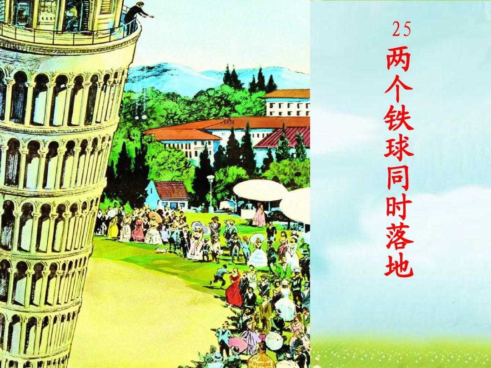
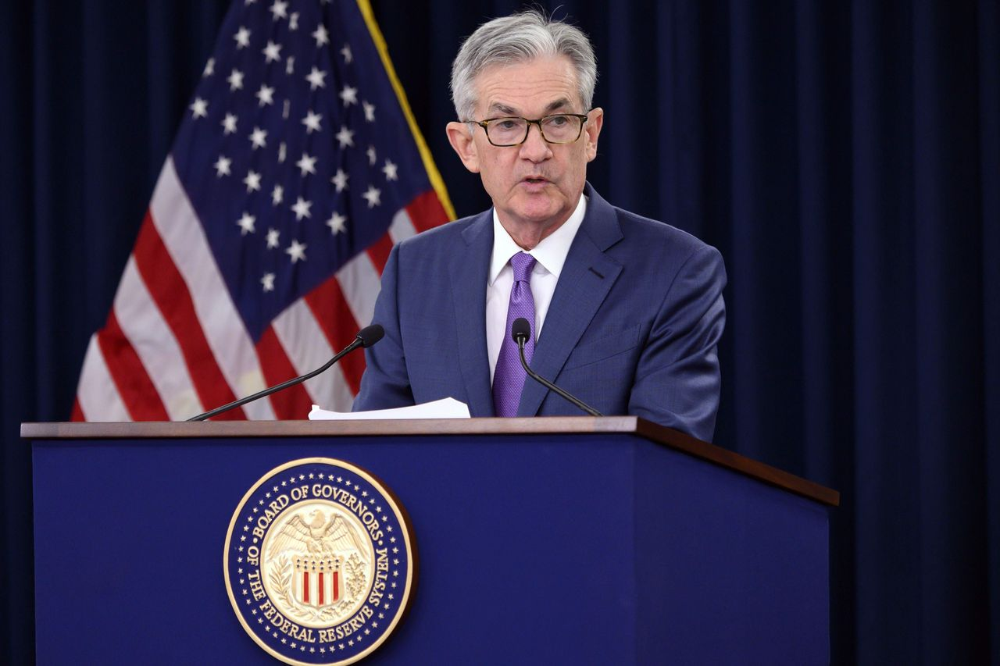
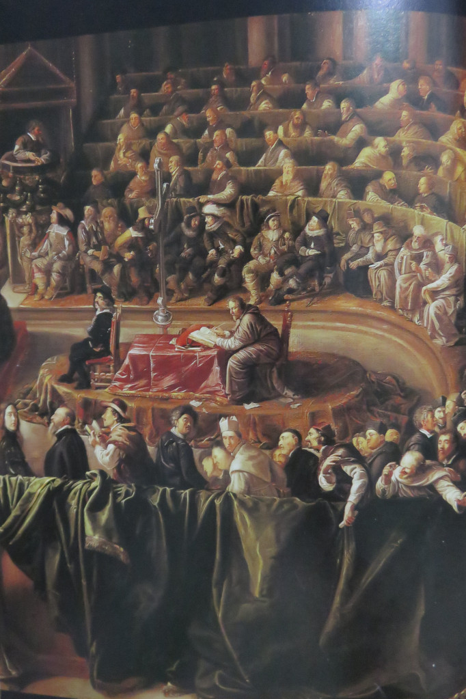
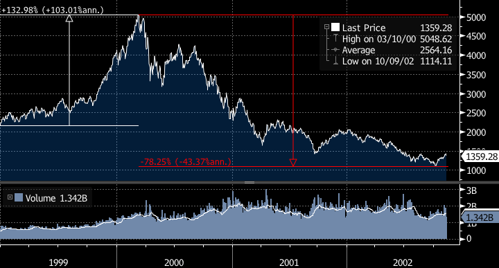

金融是一个不精确，不优雅的学科，这是我的一切金融理念的起点。

<!--more-->

人类的各种学科可以分成两种：人造学科，非人造学科。非人造学科的巅峰代表为数学和物理两大学科，我不知道这两门学科是被谁创造出来的（我是无神论者），但肯定不会是人类。人类能做的只是“发现”而非“发明”数学物理定律。在没有人类的宇宙空间，数学物理定律依然成立。

 数学，物理这类非人造学科的特点是：不由人类创造，也不会受到人类影响。数学和物理的结果是由其本身原理决定的，人类不可改变。例如经典的“两个铁球同时落地”。大哲学家亚里士多德说两个铁球不同时落地，伽利略反对，并用实验证明，大哲学家错了。铁球落地属于物理现象，结果早已注定，无论做多少次实验都只有一个结果。无论王公贵族还是贤者豪强，谁都无法改变这个结果，因为物理本质上就是非人造学科。

相对比之下，人造学科就是被人类创造，且能被人类影响的学科，典型的就是金融学。发行货币，金融交易等等一切金融行为都是由人类来实行的，动物就不会，无人的宇宙空间中更不会存在金融行为。世界上有非常多的人可以影响到金融的方方面面，例如国家元首，央行行长，投资大鳄，甚至一个散播网络谣言的人。

这个人在任期内对全球金融市场举足轻重

数学物理这种学科的原理是固定不变的，所以数学物理问题的答案存在一个固定的“终点”，等待人来发现，无论过了多久，这个终点都不会转移。而金融学由于其人造学科的属性，受到太多因素影响，导致相当多的金融问题几乎没有精确答案，而是存在一个“可能区间”，例如资产价格估值。金融问题的答案并没有“终点”这一概念，更多的是一个“时刻在迁移的不稳定平衡点”。不计其数的投资人通过各种路径追逐这个平衡点，永不停歇。每当投资人觉得自己靠近这一平衡点时，只要有相关人士（例如，当年的特朗普）出来发表言论影响市场，或者各种能够干扰市场的因素发生，这个平衡点又移走了。投资人和投资圣杯之间的追逐游戏，永无尽头。

 金融市场上的所有人都会判断错。有的时候，是投资人根本没有找到市场平衡点；有的时候，是短暂地找到了平衡点，但平衡点变动太快，而他没有发觉，就又跟丢了。看待一个资产的价格，投资人不应该把自己限定为单纯的“多头”或者“空头”，而更应该是一个“滑头”。市场永不停歇，平衡点在不断变化，投资人也要身段灵活，及时跟上。

 有必要理清三个概念：你的观点，市场的主流观点，真理。

 真理揭示了金融市场上正确的平衡点，但无法达到，只能靠近，因为金融不精确。

 金融市场由无数的参与者组成，每个参与者都有自己的观点，汇聚在一起，就会形成一个市场主流观点，可以认为是管理资产规模加权观点。

 你的观点，市场的主流观点，真理，这三个概念可以互不相同。

 金融市场的反应往往是最快的，却不是每次都正确。事实上，以人类的渺小，市场主流观点也常常会出错。正因为市场主流观点存在错误，导致价格和价值的偏离，投资人才可以盈利。投资人不要逆势而为地遵循真理建仓，因为往往活不到真理揭晓的时候。

 举个例子，哥白尼的原始版“日心说”（太阳是宇宙中心，地球绕着太阳转）虽然不是真理（因为太阳只是太阳系的中心，而非宇宙中心），但比“地心说”更接近真理。但在古代欧洲，市场主流观点是“地心说”。如果你在那个年代，逆势而为，坚持日心说，是不可能获得鲜花与掌声的，倒有可能被捕入狱（例如伽利略）。

伽利略被罗马宗教法庭审判

总有一天，市场主流观点会纠正原先的错误，回归到正确轨道上，但那个坚持真理的人未必能活到那个时候。

 投资人应该认清自己进入市场的目的：盈利，而非证明真理。最理想的结果是：接近真理（但没法到达），且知晓市场主流观点，当市场主流观点和真理相去甚远时，便意味着有巨大的投资机会。最理想的情况是：投资人能提前一步预判市场主流观点，顺应主流观点提前建仓（做多or空），但内心要清楚市场是错的，并在市场发现错误之前逃离，再反向建仓（做空or多）。

 用一个例子来解释对“市场主流观点”和“真理”的选择。当事人是投资界一代宗师，老虎基金的Julian Robertson，和量子基金的Druckenmiller（背后是Soros）。

 1999年上半年，美国纳斯达克的互联网科技股兴起，很快价格就被炒上了天，Druckenmiller和Robertson都看出来了泡沫不可持续（此为当时环境下的真理）。

 老虎基金最初选择不掺和科技股，最后无奈加入泡沫之中。Robertson初始认为科技股股价过高，选择集中投资传统价值型股票。然而1999年初，Robertson持有的美国航空公司(AAL.US)股价在短短三周内下跌了29%，辉门公司上半年下跌30%。此时投资者已经对价值型股票不感兴趣，Robertson忽视科技股热的选择令得投资者开始大规模撤资。Robertson为了获利不得不买入科技股。在1999年3月，他建立了一个2亿美元的科技股投资组合。但2亿美元的头寸相对老虎基金的规模还是太小。

 老虎基金1999年当年损失19%，遭遇投资者不断赎回，基金规模也从230亿美元急剧缩水到60亿美元。2000年1-2月，纳斯达克指数继续上升，老虎基金前两个月再度巨亏13%，终于撑不住了，到2000年2月份不得不清盘了结。

 量子基金初始选择和科技股泡沫做斗争，最终也成为泡沫的一员。量子基金的基金经理Druckenmiller刚开始挑选了12只被高估的科技新股，做了价值2亿美元的空头。然而这些公司的股价都势不可挡地上涨，不到几个星期Druckenmiller就损失了6亿美元。1999年5月，豪斯曼基金宣布将对量子基金的投资削减一半以上。Druckenmiller发现势头不对，于是赶紧掉头，跟上市场主流观点，在1999年最后几个月里反手做多科技股，不仅迅速弥补当年亏损，而且还大赚35%。不仅如此，Druckenmiller又及时在高位出逃成功，在2000年2月将科技股出清，量子基金由此大赚而特赚。

 总结起来，Robertson比较头铁，虽然他看对了当时市场的真理，但是在一个充满狂热气息的市场，相对清醒的人就是被排斥的异类。没人知道真理和意外哪一个先来临。Robertson没能坚持到真理揭晓之时。纳斯达克指数在2020年3月10日后开始下跌，Robertson在2000年2月份清盘基金，非常可惜。如果Robertson当时能不那么头铁，能增加科技股多头头寸，1999年的业绩就未必会那么惨淡，也不至于在2000年清盘。不过，Robertson毕竟是一代宗师，在清盘了自己的老虎基金后专注培养学生，教出了一批后来大获成功的“小虎队”，也算是功成名就，其结局堪称圆满。

 相比之下，Druckenmiller就比较滑头，一开始看空科技股，但发现市场主流观点是看多后，就反手做多，跟着市场狂欢，并且及时逃顶。然而，Druckenmiller似乎没能坚持自己的真理。他逃出去不久后，可能是被市场狂热情绪改变了观点，他竟然又回到市场中继续做多科技股。结果纳斯达克指数在2020年3月10日达到顶点，随后急转直下，量子基金巨亏，损失50亿美元。2000年4月28日，大老板Soros宣布关闭量子基金。

纳斯达克综合指数1999年-2002年，数据来源：彭博

如果Robertson能不那么坚持真理，如果Druckenmiller能更坚持真理，二者的这场世纪赌局都会获得圆满。尤其是Druckenmiller，先于市场发现真理，但是身段灵活，被市场打脸后立刻反手做多科技股，并且高位逃顶成功，展现出了极高的灵活性和对时机的精准把握。如果Druckenmiller在2000年2月后能坚持当初的真理，在逃顶后反手做空，这场世纪赌局就完美了。

 然而，世界没有那么多如果。

 世界经济史是一部基于假象和谎言的连续剧。要获得财富，做法就是认清其假象，投入其中，然后在假象被公众认清之前退出游戏。

 回归起点，金融是个不精确，不优雅的学科，在这个市场上，所有人都会错，投资宗师也不例外。所以，投资人最好能时刻保持自省，在面对市场主流观点保持身段灵活的同时，也保持对真理的敬畏。预测“看多”或“看空”不是最重要的，因为任何人都会看错，最重要的是风控，是及时迭代认知并追寻真理的能力，是（尽可能长久地）活下去。