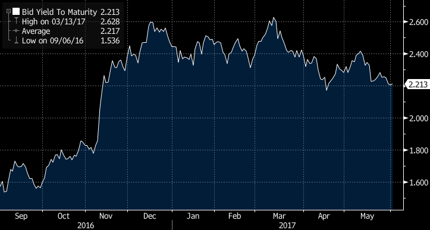
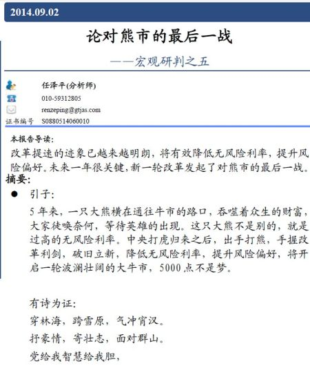
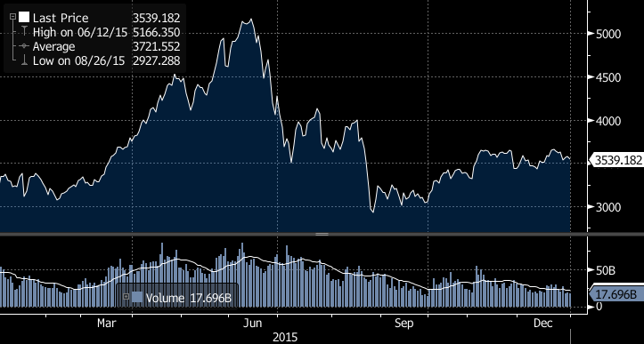
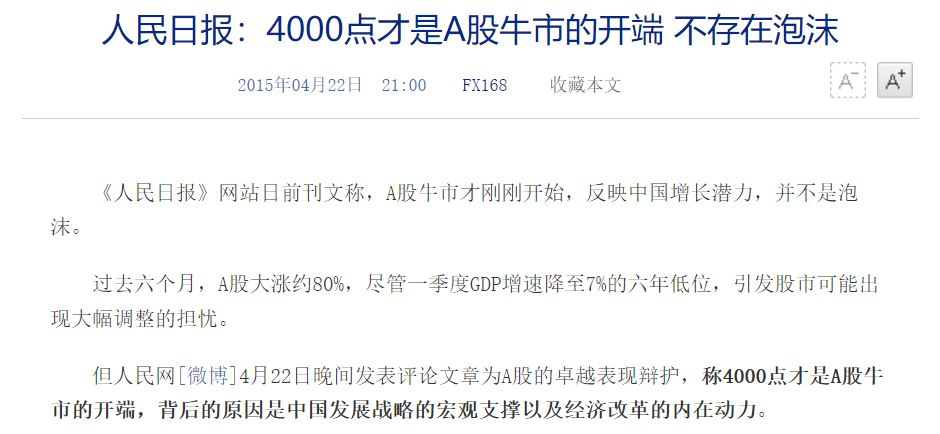

任何一个资产的价格，都会存在影响因素。金融市场由所有参与者决定，每一段时间，所有参与者关注的因素汇集到一起，必然会发现某些因素受到的关注最多。而因为人类大脑的局限性，人在同一时间能聚焦的思考重点数量总是有限的。这就导致了，某一时间段内，对市场真正起到影响作用的因素只有个位数。我把这些真正起作用的因素，定义为“影响因素”。市场焦点常常变换，影响因素也不断变动。

<!--more-->

例如，特朗普当权时期，经常发个推特就能搅动全球金融市场（尤其是中美两国）。在那段期间，特朗普的政策倾向，甚至一时兴起的胡言乱语显然都是足以影响全球资产价格的因素之一，全球宏观交易员不得不时刻盯着特朗普的推特，天天担忧特朗普不按常理出牌。“特朗普”是那几年的市场不容忽视的影响因素，甚至常常是排在前三位的影响因素。2021年后，特朗普下台，显然，他对金融市场的影响力立刻大减，现在（2021年底）已经不能算是影响因素。

在某些市场风格下，各个影响因素呈现出“势均力敌”的状态，反映在资产价格上就是区间交易。当有一个影响因素开始脱颖而出，即意味着看重该影响因素的资金量足够大到可以决定市场走势时，这个影响因素就成为了主要因素。主要因素是对当前资产价格的主导定价因素。识别当前市场风格下的影响因素，尤其是主要因素，是交易中最重要的事。

比如，2016年11月9日以后，美国国债出现一波收益率急升，这便是特朗普预期引发了投资者对于美国财政赤字和通胀的担忧。虽然期间仍然存在诸如美国通胀预期并未真实提升等对于国债收益率有压制的因素，我们还是看到美国十年期国债收益率持续上升，因为这一阶段，特朗普是主要因素。12月20日以后，美国国债收益率企稳，说明特朗普因素重要性下降，市场的各影响因素之间重新达成某种平衡，价格形态上进入了一个区间震荡阶段。

十年期美国国债收益率走势2016.9-2017.6（数据来源：彭博）

每一个特定阶段，资产价格都有自己的影响因素，找出这些影响因素，再分辨出主要因素（如果存在），是判断未来价格走势的核心。

------

索罗斯的“反身性”

反身性是认知函数作用于市场从而引发市场变化，这种变化又反过来影响认知函数的过程。即，在金融市场，认知影响价格，价格又反过来影响认知。如果用x表示参与者的认知，y表示资产价格，f和g表示它们之间的函数映射关系。

y=f(x)

x=g(y)

x,y可以互相影响彼此。那么，x变动->y变动->x变动->y变动......双方互相扰动，永不停歇。

互相扰动可以分为两类：

1. 互相加强，表现为单边（上涨或下跌）行情，例如x上涨->y上涨->x上涨->y上涨......直到趋势变换成区间震荡，或者崩盘（如果之前是上涨）。
2. 互相抵消，表现为区间震荡行情，例如y上涨->x下跌->y下跌->x上涨->y上涨......直到下一次趋势反转。

最赚钱的交易是趋势反转交易，发现趋势反转的关键就在于判断出将要面对的反身性是不是互相加强的那一类型。

举个互相加强型反身性的例子，2015年A股股灾。这次股灾的背景，是国家希望通过资本市场的全方位改革来增强投资者信心，为配合这个战略任务，国家各部门分别实施开启宽松货币政策周期、发展金融创新产品、降低股票市场交易成本等措施，期望为资本市场发展提供良好的制度环境和政策红利。在这个政策背景下，当时的参与者们逐步形成了“国家会制造政策牛市”的一致认知，而且股市的不断上涨又加强了这种认知，即人们认知股市会上涨->股市真的上涨了->认知强化，吸引更多的人和资金参与其中->股市又上涨了->认知再次强化，人们的信心越来越强烈，这个过程是典型的互相加强型反身性。

这一轮股灾期间有几个标志性的事件，一个是在2014年9月2日高呼“5000点不是梦”，“党给我智慧给我胆”的明星分析师，任泽平。

事后的发展也确实印证了任泽平的观点，上证指数在2015年6月12日达到顶峰5166点。而任泽平在5月27日时又大呼“我理性了，市场疯了”，开始提示风险，随后不久股市大跌，这使他在2015年一战封神。

上证指数2015年全年（数据来源：彭博）

2015年的A股股市狂热，除了有任泽平这样的市场人士鼓动以外，官媒亲自下场带节奏也是重要的推动因素，这进一步强化了人们对于“政策牛市”的认知。

官方造势（政策牛），民间乐观（相信政策牛），股市上涨，形成了互相加强的反身性，反映到股市上就是一飞冲天。对于散户来说，一根大阳线就足以改变他们的信仰；而大部分训练有素的基金经理不会这么肤浅，不会被区区一根大阳线迷惑——他们需要两到三根。在当时的市场环境下，只要股市指数够高，没几个人还能保持理性。

在这种狂热的单边上涨行情下，如果不能及时改变市场预期，而上涨又不可能涨到天上，那唯一的后果只能是涨得快，跌得更快，也就是股灾。

市场很多时候是区间震荡行情，在这种行情下，可以赚点低吸高抛的小钱。而要想做出一笔名留青史的经典交易，必须要把握住互相加强型的反身性，这样才会有大行情。只是一定要牢记真理和市场主流观点的差别，参见

[金融不精确]: https://venus.caelumfamily.com/post/financeunprecise/

通过对影响因素，主要因素，反身性概念的理清，我提出一个分析框架：

1. 首先需要厘清资产价格的影响因素，这个过程需要对资产性质有深入理解和极多的交易经验。
2. 判断各个影响因素是势均力敌，还是有一到两个因素脱颖而出，成为主要因素。
3. 判断影响因素（尤其是主要因素）和价格之间的反身性关系，是相互加强还是相互抵消。

对物理学的探索，包括“大胆猜想，小心求证”两个重要环节。对金融交易而言也是类似的。在制定交易策略前，投资人应该提出对影响因素的猜想。这些因素既要有历史数据的验证，同时也要符合经济逻辑和常识，这两个条件缺一不可。有了这些猜想后，再用真实的市场进行小心求证。当市场行情可以验证某个主要因素开始脱颖而出时，随后往往出现趋势反转，单向突破，这个时候，投资人就会面临最重要的考验。

参考文献：

1. [赵静, 薛澜, & 王宇哲. (2020). 旧瓶新酒: 对 “2015 年股灾” 成因的公共政策过程解释. 公共管理学报, 17(2), 1-13.](旧瓶新酒：对 “2015 年股灾”成因的公共政策过程解释.pdf)