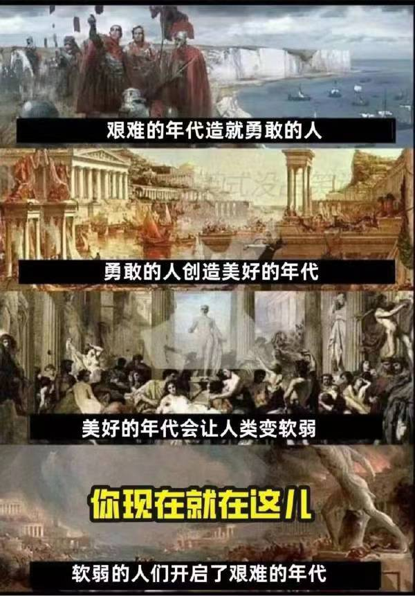

人类历史的长河中，混乱和贫穷才是主流。自第一次工业革命后，生产力飞速发展，物质供应随之大大增加，但分配制度的不成熟，以及国际秩序的缺失，给人类带来了海量的利益冲突，冲突导致了纷争，纷争引发了战争。两次世界大战将大量国家或地区打成了废墟，也让当地的人们对战争心生恐惧，再加上核武器的发明让各主要大国形成了“互相毁灭平衡”的制约，大国之间都不敢轻举妄动，人类才终于迎来了久违的大体和平环境，至今已有70多年。这个和平时期在人类历史上是少数时期。不过，这份脆弱的大体和平不是将被打破，而是已被打破。

 <!--more-->

2.现在的时代有什么不同？

2.1  外部原因

显而易见的是，中美关系已经破裂，并且短时间内没有修复的可能。这是黄金时代离去的重要原因，但因为过于明显且相关论述随处可见，所以就不赘述了。

 

另一方面，任何一个大国，都不可能被外敌击溃，而只可能因内部矛盾导致解体而失败（苏联就是典型）。所以内部原因才是我们该关注的重点。

 

2.2  内部原因

生于忧患，死于安乐，千年前的古人以其对人性的认知，预示了人类历史必然会重复发生的荒谬轮回。

 

前人栽树，今人乘凉。今人砍树，后人遭殃。

 

前人努力奋斗追求更好的生活，更文明的环境，这一切都让今人坐享其成，生存难度下降。然而，饱暖思淫欲，无聊瞎作妖，今人在低难度的环境逐渐劣化，能力和认知退步，失去进取的意愿和能力。更有甚者，作妖瞎搞，掀起歪风邪气，将世界推向危险的边缘，让后人遭殃。

 

从1966年到1992年，经过几十年的动荡，当局拨乱反正，淡化意识形态斗争，实事求是地提出“实践是检验真理的唯一标准”，可谓客观中肯，科学合理。自九二南巡之后，国内统一了思想，以经济建设为重，全国上下一门心思地努力致富。当年的人们经历了长时间的贫穷，一旦赶上了合适的年代，整个社会迸发出无尽的活力。人们的普遍心态是积极向上的，做事也是务实高效的，一切以效率为优先。

 

前人们不懈努力，在近三十年内把日子越过越好。但，水满则溢，月满则亏，好日子不会一直持续下去。这其中，固然有历史周期原因，国际政治原因，但也少不了“人祸”的推波助澜。历史周期和国际政治变化乃客观规律，无法避免。我们更应该关注的是“人祸”的因素，这才是值得每一个人深思的。

 

何为“人祸”？包括但不限于：政治性幼稚，表演型人格障碍，鸵鸟式软弱。

（1）    政治性幼稚

政治，看似人人都能插嘴说两句，然而其实是门槛极高的学科。只有三种人能称得上懂政治：

​      i. 政治学者，专门研究政治，自然算得上懂；

​      ii. 政治家或政客，以政治作为职业，积累了实践经验，也算得上懂；

​     iii. 成功的全球宏观对冲基金经理，全球宏观投资受国际政治影响极大，能挺过大浪淘沙的成功投资者，也是政治行家。

 

当然，上述三者只是极少数。大多数人都是政治性幼稚的。

 

认识政治，首先要认识到政治的一个根本性原则：政治是面对现实的学问。

                               

需要认清两个概念，“现实世界”，“空想世界”。

 

现实世界，即我们目前生活的这个真实的世界，即地球。现实世界只有一个。

 

空想世界，即目前的现实中不存在的，只存在于人们想象中的虚构世界。人们幻想着这个虚构世界中的秩序，并得出“世界应该怎样”，“我们应该做什么，追求什么”等结论。由于每个人的想象并不相同，所以空想世界并不唯一。甚至持有不同理念的人的空想世界是互相对立的。

 

这里用的是空想世界，而非理想世界。因为很多人的想象并不实际，甚至堪称愚蠢，用理想都是抬举了，用空想更贴切一点。

 

混淆现实世界和空想世界，以空想世界里的标准要求现实世界，提出无理的诉求，这就是政治性幼稚。

 

政治性幼稚的问题在于：

​     i. 空想世界的标准可能是不合理，不正确的。强行推动少数人的错误空想，甚至可能带来灾难。

​    ii. 即使空想世界的部分标准是合理的，也有可能是现有条件下无法实现的，即，人不能拔苗助长，还没到条件成熟的时候，不能硬来。

 

问题的关键在于：人们的某个诉求是否是合理、公正的？即使是合理、公正的诉求，追求到什么程度是恰当的？

 

要做出合适的判断，需要的是常识。然而可惜的是，对于普通民众来说，常识是个稀缺的东西。甚至，有学历不等于有常识，因为很多知识分子脱离群众，即中文语境的“不接地气”，即使高学历的部分人也有可能缺乏常识。

 

无论任何时代，任何国家，大部分人掌握的常识都是不全面的，尤其是政治学常识。人们也许有自己的专业，在自己的专业里能算得上知识渊博，但一旦离开自己的专业就泯然众人，并无高见，即使是高学历的人也会这样，至于没有高学历的人就更会这样。这导致大部分人都缺乏常识。

 

普通人有政治性幼稚是正常的，世界各国都是这样。但是，一旦有大量政治性幼稚病患者积极议论政治，甚至参与政治，制造舆论干扰政治，那就是巨大的灾难。而这样的灾难，正在多个国家发生。

 

（2）    表演型人格障碍

互联网是人类到目前为止最重要的发明之一，带来的好处很明显，就不赘述了。这里重点讨论互联网带来的坏处。

互联网技术的成熟，催生了社交网络，让人与人之间的信息传递变得前所未有的通畅。但是，当人们发现可以用社交网络来打造自己的人设后，越来越多的人患上了表演型人格障碍。于是，人们或出于虚荣，或出于商业利益，或二者兼而有之，纷纷在社交网络上扮演一个虚假夸张的自己。如果是出于商业利益，那这是商业行为，在商言商，还能算事出有因；如果仅仅是为了虚荣，没有任何实质性好处，这种症状就是表演型人格障碍。

大量的人患上表演型人格障碍，最直接的后果是使世界陷入了“政治正确吹牛竞赛”，动动嘴没有成本，反正又不会兑现。A吹1，B就吹100，C再吹100万，吹到最后越来越偏离现实，成为闹剧。互联网大大加快了这种病症的传播速度，也大大增加了表演型人格障碍的病患数量。这种人多了，整个世界就会显得光怪陆离，脱离常识。

 

（3）    鸵鸟式软弱

字面意思，很好理解，不赘述。鸵鸟式软弱的后果，引用一段古文：

 

 “以地事秦，犹抱薪救火，薪不尽，火不灭。”——《六国论》

 

越极端的人，发出的舆论声音传播越广，1%的人也可以占据网络舆论主导权。而“沉默的大多数”人因为鸵鸟式软弱，或没有意识到，或懒得参与舆论发声，导致网络舆论严重失真，完全不能反映真实的民意。沉默的大多数就这样将舆论的高地拱手让人，进而丢失现实世界中的权利，以妥协退让换得一时安宁，却眼睁睁地看着自己熟悉的世界一步步变烂，直到忍无可忍，而那时已经晚了。

 

上述3点，第（1）类人主动带起了各种歪风邪气，第（2）类有不少人为了表演而为第（1）类人摇旗呐喊助威，而第（3）类人沉默软弱，没有及时制止歪风邪气的蔓延，世界就这么一步步滑向深渊。

 

上面只说了原理，本应该附上现实世界的例子，但这些例子只会在内部传播，因各种原因不会公开，故这里省略N段内容。

 

前人栽树，今人乘凉。今人砍树，后人遭殃。今人不仅损害了前人积累的成果，还败掉了本该留给后人的家底，一代人拖累上下两代人，但是今人作为罪魁祸首却仍然能生活在最舒服的时代，坐享其成，这种事极不公平，然而世上没有公平。

 

  

显而易见的是，即使我写下这么多，陷入魔怔的那部分今人绝不会听进去一个字，仍会在作妖瞎搞，扰乱世界的道路上一去不复返。我说的所有道理都是给后人听的，让后人知晓这个时代的真相，知晓曾经美好的世界是怎么变坏的，知晓罪魁祸首是谁。

 

然而，即使后人看了这些道理，他们就会吸取教训，不再犯错吗？

 

不会的，人类从不吸取教训，总是在重复相似的错误。生于忧患，死于安乐，千年前的古人以其对人性的认知，预示了人类历史必然会重复发生的荒谬轮回。

 

那么，做这一切的意义在哪里？难道真是毫无意义的吗？

 

不！做这一切的意义就在于：

 

## **还历史以真相，还真理以尊严。**

